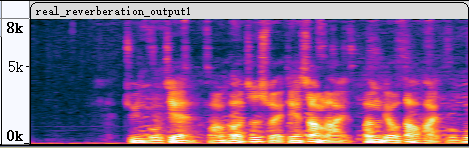

# Location Based Target Speech Extraction in Spherical Microphone Array 

Wang Shiqi, 2023.04.11

## 仿真数据:

**观测信号**

<audio src="rotSepNet_output/simu_mix.wav" controls="controls">
Your browser does not support the audio element.
</audio>

**参考目标信号**

<audio src="rotSepNet_output/simu_ref.wav" controls="controls">
Your browser does not support the audio element.
</audio>

**估计目标信号**

<audio src="rotSepNet_output/simu_output.wav" controls="controls">
Your browser does not support the audio element.
</audio>

**估计目标信号（因果模型）**

<audio src="rotSepNet_output/simu_output_casual.wav" controls="controls">
Your browser does not support the audio element.
</audio>

## 真实数据，消声室

**观测信号**

<audio src="rotSepNet_output/real_anechoic_mix.wav" controls="controls">
Your browser does not support the audio element.
</audio>

**估计目标信号（声源1）**

<audio src="rotSepNet_output/real_anechoic_output1.wav" controls="controls">
Your browser does not support the audio element.
</audio>

**估计目标信号（声源2）**

<audio src="rotSepNet_output/real_anechoic_output2.wav" controls="controls">
Your browser does not support the audio element.
</audio>

## 真实数据，混响室

**观测数据**

<audio src="rotSepNet_output/real_reverberation_mix.wav" controls="controls">
Your browser does not support the audio element.
</audio>

**估计目标信号（声源1）**

<audio src="rotSepNet_output/real_reverberation_output1.wav" controls="controls">
Your browser does not support the audio element.
</audio>

**估计目标信号（声源2）**

<audio src="rotSepNet_output/real_reverberation_output2.wav" controls="controls">
Your browser does not support the audio element.
</audio>